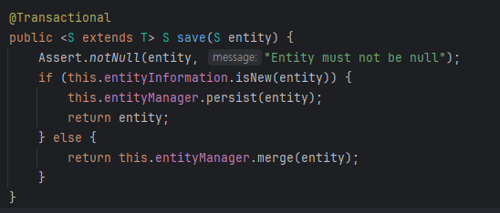

# Spring - @Transactional Test

### 테스트 환경

- Parent
- Child

## @Transactional(propagation = REQUIRES_NEW)의 오해

### 테스트 방법

> ParentService.save() = `@Transactional`  
> ChildService.save() = `@Transactional(propagation = REQUIRES_NEW)`

1. ParentService.save() 메서드를 호출
2. ParentRepository -> Parent Entity 저장
3. ParentService.save() 메서드에서 ChildService.save() 메서드를 호출한다.
4. ChildRepository -> Child Entity 저장
5. ChildService.save() 메서드에서 IllegalStateException 발생

### 테스트 결과

- ParentService 트랜잭션과 ChildService의 트랜잭션은 별도의 트랜잭션은 맞다.
- 하지만, **동일 스레드**에서 각각의 트랜잭션(커넥션도 별도)을 사용!
- 이러한 경우, ChildService의 트랜잭션에서 예외가 발생하면, 상위의 ParentService의 트랜잭션이 롤백이 되는 문제가 발생함.
- 따라서 ChildService의 트랜잭션에서 예외가 발생한 경우를 처리해줘야 함.

ex. try-catch 문을 사용,,

## @Transactional(readOnly = true)의 오해

@Transactional(readOnly = true) 옵션을 주고, save를 호출한다면?

### 테스트 방법

- ParentService - @Transactional(readOnly = true) 옵션 설정
- ParentRepository.save() 호출

### 테스트 결과

- 에러가 발생하지 않음.
- 또한, ParentRepository.count() 호출 시 저장된 것을 확인할 수 있음.
- JpaRepository의 save() 메서드는 SimpleJpaRepository의 save() 메서드를 호출

_SimpleJpaRepository - save_

- 위의 코드를 보면 `@Transaction` 어노테이션이 별도로 설정되어있는 것을 볼 수 있음.
- 따라서, `@Transactional(readOnly = true)` 옵션을 주더라도, `save()` 메서드는 `@Transactional` 옵션을 따르게 됨.

