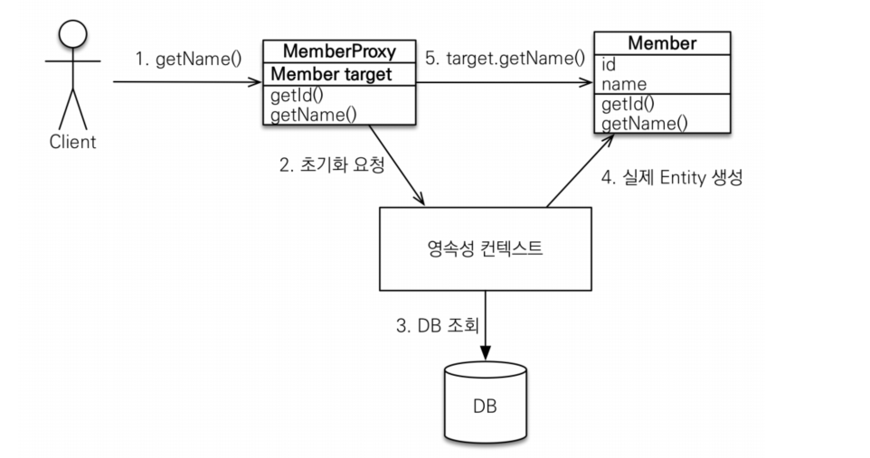
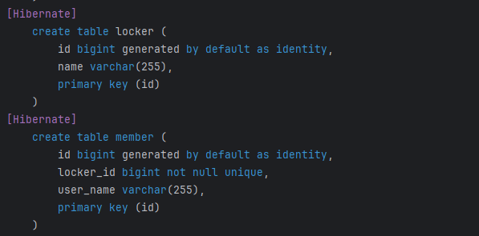

# Spring - @Transactional Test

### 테스트 환경

- Parent
- Child

## @Transactional(propagation = REQUIRES_NEW)의 오해

### 테스트 방법

> ParentService.save() = `@Transactional`  
> ChildService.save() = `@Transactional(propagation = REQUIRES_NEW)`

1. ParentService.save() 메서드를 호출
2. ParentRepository -> Parent Entity 저장
3. ParentService.save() 메서드에서 ChildService.save() 메서드를 호출한다.
4. ChildRepository -> Child Entity 저장
5. ChildService.save() 메서드에서 IllegalStateException 발생

### 테스트 결과

- ParentService 트랜잭션과 ChildService의 트랜잭션은 별도의 트랜잭션은 맞다.
- 하지만, **동일 스레드**에서 각각의 트랜잭션(커넥션도 별도)을 사용!
- 이러한 경우, ChildService의 트랜잭션에서 예외가 발생하면, 상위의 ParentService의 트랜잭션이 롤백이 되는 문제가 발생함.
- 따라서 ChildService의 트랜잭션에서 예외가 발생한 경우를 처리해줘야 함.

ex. try-catch 문을 사용,,

## @Transactional(readOnly = true)의 오해

@Transactional(readOnly = true) 옵션을 주고, save를 호출한다면?

### 테스트 방법

- ParentService - @Transactional(readOnly = true) 옵션 설정
- ParentRepository.save() 호출

### 테스트 결과

- 에러가 발생하지 않음.
- 또한, ParentRepository.count() 호출 시 저장된 것을 확인할 수 있음.
- JpaRepository의 save() 메서드는 SimpleJpaRepository의 save() 메서드를 호출

_SimpleJpaRepository - save_


- 위의 코드를 보면 `@Transaction` 어노테이션이 별도로 설정되어있는 것을 볼 수 있음.
- 따라서, `@Transactional(readOnly = true)` 옵션을 주더라도, `save()` 메서드는 `@Transactional` 옵션을 따르게 됨.

## @Transactional - Isolation

```java
package org.springframework.transaction.annotation;

import org.springframework.transaction.TransactionDefinition;

public enum Isolation {

    DEFAULT(TransactionDefinition.ISOLATION_DEFAULT),

    READ_UNCOMMITTED(TransactionDefinition.ISOLATION_READ_UNCOMMITTED),

    READ_COMMITTED(TransactionDefinition.ISOLATION_READ_COMMITTED),

    REPEATABLE_READ(TransactionDefinition.ISOLATION_REPEATABLE_READ),

    SERIALIZABLE(TransactionDefinition.ISOLATION_SERIALIZABLE);

    private final int value;


    Isolation(int value) {
        this.value = value;
    }

    public int value() {
        return this.value;
    }

}

```

# JPA - N+1

> N+1이 @OneToOne 관계에서도 발생한다?

### 읽어보기

- [Spring boot :: JPA에서 OneToOne 관계 N+1 문제 정리](https://wave1994.tistory.com/156)
- [OneToOne 관계는 과연 지연로딩이 되는가?](https://velog.io/@yhlee9753/OneToOne-%EA%B4%80%EA%B3%84%EB%8A%94-%EA%B3%BC%EC%97%B0-%EC%A7%80%EC%97%B0%EB%A1%9C%EB%94%A9%EC%9D%B4-%EB%90%98%EB%8A%94%EA%B0%80)
- [JPA @OneToOne은 FetchType.LAZY가 안 먹힐 수 있다?](https://jeong-pro.tistory.com/249)

## 원인

- `@OneToOne` 관계의 Default FetchType은 EAGER
- But, LAZY로 설정해주어도 EAGER로 동작하는 예외적인 상황이 발생
- 단방향 `@OneToOne` 관계에서는 문제가 없지만, **양방향** @OneToOne 관계에서는 무조건 EAGER로 동작한다.

> _정확히 얘기하자면_  
> OneToOne 양방향 연관 관계에서 연관 관계 주인이 아닌 엔티티를 조회할 때, LAZY 전략이 무시되고 EAGER 전략으로 동작한다.

## 이유



- fetchType.LAZY로 동작하기 위해서는 JPA 구현체에서 `Proxy` 를 만들어 줘야 한다.
- 또한, JPA 구현체는 연관 관계 Entity에 **Null** 또는 **프록시 객체**가 할당되어야 한다.

_아래는 테이블의 구조_



- locker 테이블 컬럼에 Member에 관한 정보가 존재하지 않는다.
- 따라서, Member Entity에 대한 정보가 없는 상태에서 `@OneToOne` 양방향 관계인 상태
- 이러한 상황에서 Member Entity를 조회하게 되면, JPA 구현체는 Member Entity에 대한 정보가 없기 때문에 **프록시 객체**를 만들어 줄 수 없다.

# Spring JPA 사실과 오해 - NHN FORWARD

> link : [YOUTUBE - NHN Cloud](https://youtu.be/rYj8PLIE6-k?si=tPTA8nIHZtiZu8ix)

## Contents

1. 연관관계 매핑
2. Spring Data JPA Repository

## 1. 연관관계 매핑

**Entity Mapping**

- Entity : JPA를 이용하여 데이터베이스 테이블과 매핑할 클래스
- Entity Mapping : Entity Class에 데이터베이스 테이블과 컬럼, 기본 키, 외래 키 등을 설정하는 것

**연관관계 매핑**

> 관계형 데이터베이스에서는 Join을 통해 연관된 테이블을 참조하는 반면,    
> Java에서는 객체 참조를 이용하여 연관된 엔터티를 참조하게 된다.

- 데이터베이스의 테이블의 외래 키를 객체 참조와 매핑하는 것을 의미한다.

**다중성(Multiplicity)**

- @OneToOne
- @OneToMany
- @ManyToOne
- @ManyToMany

**방향성**

- 단방향 (unidirectional)
- 양방향 (bidirectional)

**영속성 전이(persistence cascade)**

_N:1 연관관계 매핑_

```shell
[Hibernate] 
    /* insert for
        com.f1v3.jpa.domain.Player */insert 
    into
        player (created_at, name, player_id) 
    values
        (?, ?, default)
[Hibernate] 
    /* insert for
        com.f1v3.jpa.domain.PlayerDetail */insert 
    into
        player_detail (description, player, type, player_detail_id) 
    values
        (?, ?, ?, default)
[Hibernate] 
    /* insert for
        com.f1v3.jpa.domain.PlayerDetail */insert 
    into
        player_detail (description, player, type, player_detail_id) 
    values
        (?, ?, ?, default)
```

정상적으로 Player Entity에 대한 데이터 저장 후  
PlayerDetail Entity에 대한 저장이 이루어짐.

_1:N 연관관계 매핑_

```shell
[Hibernate] 
    /* insert for
        com.f1v3.jpa.domain.Player */insert 
    into
        player (created_at, name, player_id) 
    values
        (?, ?, default)
[Hibernate] 
    /* insert for
        com.f1v3.jpa.domain.PlayerDetail */insert 
    into
        player_detail (description, player_id, type) 
    values
        (?, ?, ?)
[Hibernate] 
    /* insert for
        com.f1v3.jpa.domain.PlayerDetail */insert 
    into
        player_detail (description, player_id, type) 
    values
        (?, ?, ?)
[Hibernate] 
    update
        player_detail 
    set
        player_id=? 
    where
        player_id=? 
        and type=?
[Hibernate] 
    update
        player_detail 
    set
        player_id=? 
    where
        player_id=? 
        and type=?
```

로그를 살펴보면, Player ID에 대한 정보를 추가적으로 저장하기 위해, Update 쿼리가 발생하는 것을 확인할 수 있습니다.

따라서 이러한 경우, 1:N 단방향 보다는 양방향으로 설정하여 이러한 문제를 방지하는 것이 좋다.

_1:N -> 양방향 매핑 (@MapsId)를 한 경우_

```shell
[Hibernate] 
    /* insert for
        com.f1v3.jpa.domain.Player */insert 
    into
        player (created_at, name, player_id) 
    values
        (?, ?, default)
[Hibernate] 
    /* insert for
        com.f1v3.jpa.domain.PlayerDetail */insert 
    into
        player_detail (description, player_player_id, type) 
    values
        (?, ?, ?)
[Hibernate] 
    /* insert for
        com.f1v3.jpa.domain.PlayerDetail */insert 
    into
        player_detail (description, player_player_id, type) 
    values
        (?, ?, ?)
```

## N + 1 문제에 대한 오해

### 1. N + 1 문제는 EAGER Fetch 전략 때문에 발생한다?

- Fetch 전략을 LAZY로 설정했더라도 연관 Entity를 참조하면 그 순간에 추가적인 쿼리가 발생함.

### 2. findAll() 메서드는 N + 1 문제를 발생시키지 않는다?

- Fetch 전략을 이용해서 연관 Entity를 가져오는 것은 `단일 레코드`에 대해서만 적용
- 단일 레코드 조회가 아닌 경우 (JPQL을 수행하는 경우 -> findAll() 포함)
    - 해당 JPQL을 먼저 수행 (**Entity에 설정된 Fetch 전략이 적용되지 않음!!**)
    - 반환된 레코드 하나 하나에 대해 Fetch 전략을 적용하여 연관 Entity를 가져옴.
    - 따라서, findAll() 메서드 또한 N + 1 문제가 발생할 수 있다.

## Fetch JOIN으로 N + 1 문제 해결시 유의해야 될 것

### Pagination + Fetch JOIN

- Pagination 쿼리에 Fetch JOIN 적용시, 실제로는 모든 레코드를 가져오는 쿼리가 발생
- LIMIT 조건 없이 전체 레코드를 가져온 후, 메모리에서 원하는 페이지만 가져오는 방식!!
- 즉, DB 쪽에서는 모든 레코드를 가져오는 쿼리가 발생함

> Pagination을 사용하기 위해서는 Fetch JOIN을 사용하는 쿼리와 분리해서 사용하는 것이 좋은 방향

### 1:N 연관관계가 둘 이상의 컬렉션 Fetch JOIN - MultipleBagFetchException

- Hibernate의 Bag 타입으로 java.util.List 타입을 매핑하게 됨.
- Bag 타입은 중복을 허용하고, 비순차적인(unordered) 컬렉션
- 즉, 둘 이상의 컬렉션을 Fetch JOIN 하는 경우
    - 그 결과로 만들어지는 카테시안 곱(Cartesian Product)에서 어느 행이 유효한 중복을 포함하고 있고, 어느 행이 그렇지 않은지 판단할 수 없음
    - 이로 인해 MultipleBagFetchException 발생

> 해결방법 : List를 Set으로 변경, @OrderColumn

## 2. Spring Data JPA Repository

- JpaRepository -> CRUD, Paging, Sorting 메서드 제공
- 메서드 이름 규칙을 통한 Query 생성

### JPA Repository 메서드와 JOIN

JPA Repository 메서드로는 JOIN 쿼리를 실행할 수 없다?

```java
public interface PlayerRepository extends JpaRepository<Player, Long> {

    // SELECT * FROM Players WHERE name = {name};
    List<Player> findByName(String name);

    // SELECT * FROM Players WHERE name = {name} AND created_at > {created_at};
    List<Player> findByNameAndCreateDateAfter(String name, LocalDateTime createDate);
}
```

- 하지만, JPA Repository 메서드에서는 "_"(underscore)를 통해 내부 속성 값에 접근할 수 있음!
- 또한, JPA는 데이터베이스 테이블 간의 관계를 Entity 클래스의 속성(Attribute)으로 모델링한다는 것을 생각해보면

```java
    // SELECT * FROM Player p
    // INNER JOIN PlayerDetail pd
    // ON p.player_id = pd.player_id
    // WHERE pd.type = {type};
    List<Player> findByDetails_Pk_Type(String type);
```

위와 같은 방식으로 JOIN 쿼리를 실행할 수 있다.


### Page vs. Slice

```java
    Page<Player> getAllByName(String name, Pageable pageable);
    
    Slice<Player> readAllByName(String name, Pageable pageable);
```

Page는 Slice를 상속받으며 getTotalPages(), getTotalElements() 등 페이지에 관련된 메서드가 존재!
추론을 해보자면, '개수'에 대한 쿼리가 한 번 더 나가지 않을까라고 생각을 했는데,

실제로 수행되는 쿼리를 봐보자.

```java

// SELECT * FROM Players WHERE name = {name} offset {offset} limit {limit};
// SELECT COUNT(*) FROM Players WHERE name = {name}
Page<Player> getAllByName(String name, Pageable pageable);

// SELECT * FROM Players WHERE name = {name} offset {offset} limit {limit};
Slice<Player> readAllByName(String name, Pageable pageable);
```

### JPA Repository 메서드로는 DTO Projection을 할 수 없다?

- Class 기반
- Interface 기반
- Dynamic Projection


